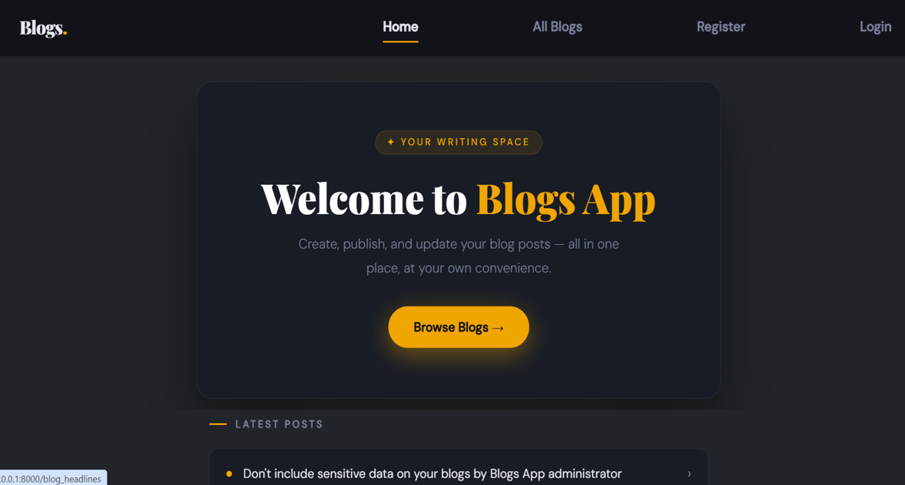
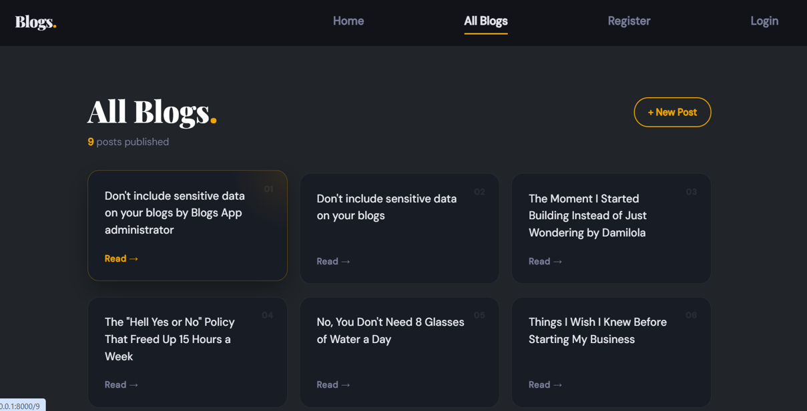

# Blogs App 📝

A full-stack blog web application built with Django, where users can create, publish, and manage their own blog posts.

## 🔗 Live Demo
[Coming soon]

## 📸 Screenshots





## ✨ Features
- User registration, login and logout
- Create and publish blog posts
- Add multiple content entries per post with automatic timestamps
- Edit existing entries
- Browse all published blogs from other users
- Responsive design across all screen sizes

## 🛠️ Tech Stack
- **Backend:** Python, Django
- **Frontend:** HTML, CSS, Bootstrap 5
- **Database:** SQLite (development)
- **Fonts:** Playfair Display, DM Sans

## 🚀 Running Locally

**1. Clone the repository:**
```bash
git clone https://github.com/yourusername/blogs-app.git
cd blogs-app
```

**2. Create a virtual environment:**
```bash
python -m venv venv
source venv/bin/activate  # On Windows: venv\Scripts\activate
```

**3. Install dependencies:**
```bash
pip install -r requirements.txt
```

**4. Run migrations:**
```bash
python manage.py migrate
```

**5. Start the development server:**
```bash
python manage.py runserver
```

Visit `http://127.0.0.1:8000` in your browser.

## 👤 Developer
**Damilola Aboyade**
[LinkedIn](https://www.linkedin.com/in/damiprofile)